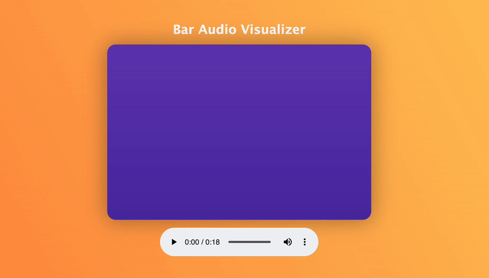

# Bar Audio Visualiser

A Web bar-styled audio visualiser 

## Description

This audio visualiser generates a graphical representation of music or sound in real-time. It's built using the Javascript Canvas API & Web Audio API

## Installing

Clone the repo
   ```sh
   git clone https://github.com/SimphiweNkabinde/bar-audio-visualizer.git
   ```

## Executing program

open `index.html` in a browser

## Usage




